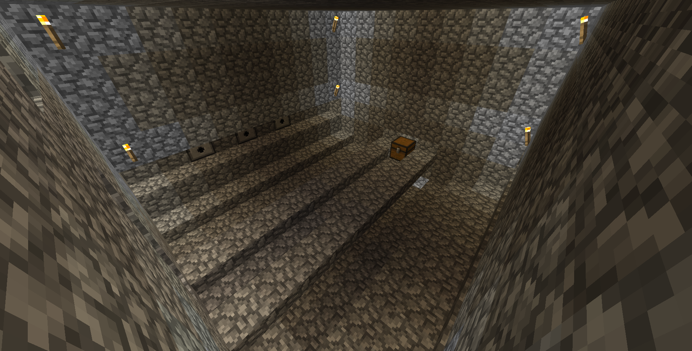
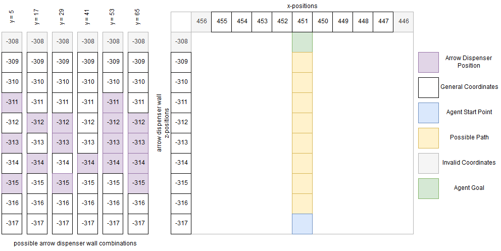
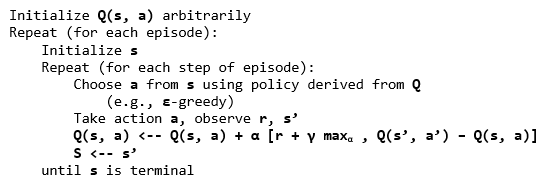
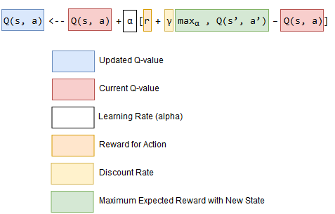
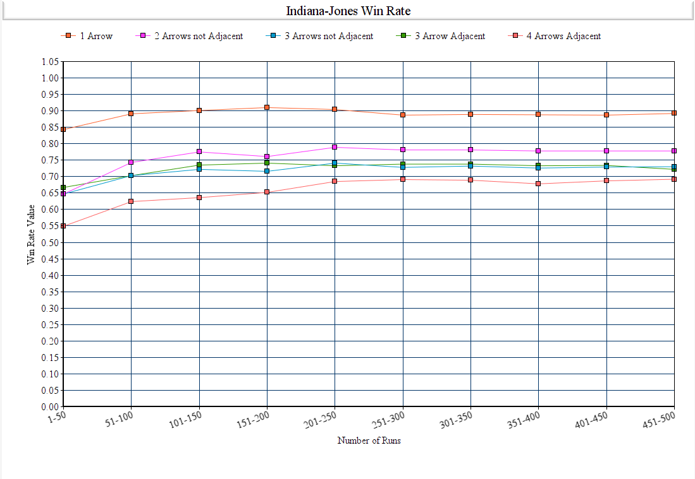
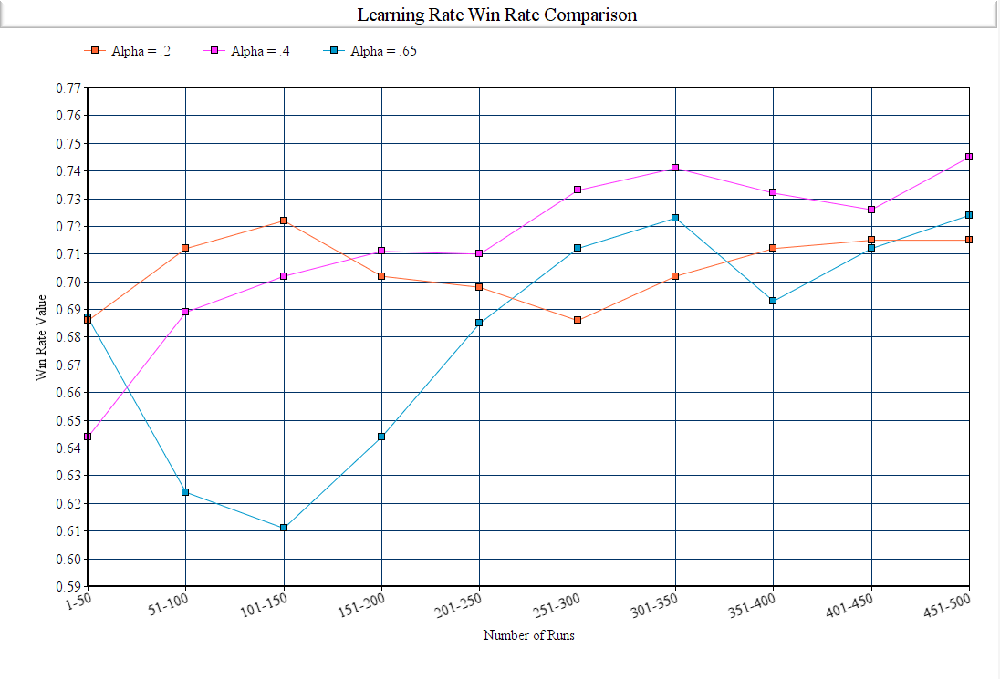
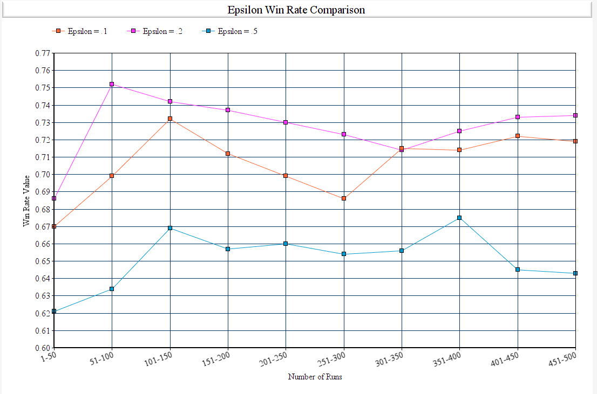
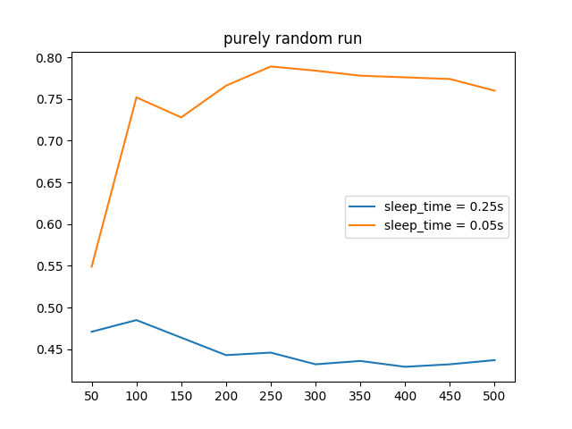

## Video:

<iframe width="560" height="315" src="https://www.youtube.com/embed/WKm6pnX_Jzs" frameborder="0" allow="accelerometer; autoplay; encrypted-media; gyroscope; picture-in-picture" allowfullscreen></iframe>

## Project Summary:

This overall goal of this project was to have our agent be able to traverse through a walkway to reach a treasure chest at the end. Along the way, however, there will be randomly placed dispensers that shoot arrows perpendicular to the walkway. Our agent, Indiana Jones, should use reinforcement learning in order to learn how to dodge these arrows to reach the treasure.

* * *

|  |
|:--:| 
| *Figure 1: In-Game Overview* |

* * *

Because of the difficulty of traversing through multiple arrows being fired, we needed a reinforcement learning algorithm in order to teach our agent when to move and when to stop. If, instead, we used a hard-coded method of avoiding the arrows, there would be the issue of the agent requiring very specific dispenser timings to cross, which would not be ideal. For example, we could design the agent to run across the walkway when all dispensers fire at once, but that would take a significant amount of waiting. To counteract this, we decided the best course of action would be a Q-learning algorithm, a reinforcement learning algorithm that integrates Q-tables.

## Approaches:

Compared to our status update, we have changed our environment with a couple major changes. The first major change was the addition of more than one arrow dispenser, while the second major change was the addition of multiple arrow dispenser configurations. Aside from the arrow dispenser changes, the walkway, start points, and end points remained unchanged.

Just as before, our agent will have a walkway that is 10 units long, with the treasure chest (goal) being at the end of the walkway. On the left of the agent, there will be randomly placed dispensers that fire at different intervals. These will be placed 6 units away from the walkway. There will be multiple variations of dispenser positions, as shown in the diagram below (*Figure 2*). We will have, at minimum, one dispenser, and a maximum of four dispensers. It is important to note the multiple stages are built atop one another; their corresponding y-values are the height of the spawn coordinates for the agent. Although the agent *may* be able to randomly move through the walkway with one dispenser, the hardest challenges will be the three staggered dispensers and four adjacent dispensers. As stated before, we believe that the best course of action was to have our agent determine its actions by accessing a Q-table, called Q-learning.

Q-learning seemed like the most appropriate approach because we could break out environment into easily-defined states and rewards. Restraining our agent to a straight pathway also helped in reducing the size of our generated Q-table.

* * *

|  |
|:--:| 
| *Figure 2: Environment Overview* |

* * *

### Q-Learning

Q-learning is a type of reinforcement learning algorithm that stores all possible states that can happen to the agent. With all these possible states, the agent chooses the state that has the highest reward. The idea of Q-learning is that the agent keeps on attempting the reach the goal, with each iteration being called an *episode*. Then, depending on the result of the episode, the agent updates its Q-table with new reward values for each possible state.

### Q-Learning Pseudocode

* * *

|  |
|:--:| 
| *Figure 3: Q-Learning Pseudocode (derived from UNSW's Reinforcement Learning page)* |

* * *

This is the primary pseudocode for how a Q-learning algorithm chooses its best action (*Figure 3*). Simplified, in the form of steps:

1. Initialize Q-table
2. Observe current state
3. Choose action based on implemented policy (i.e. soft, greedy, etc.)
4. Take action, observe the reward and newly created state
5. Update Q-value in Q-table with new reward, along with new maximum possible rewards for following state (*formula in Figure 4*)
6. Set state to new state
7. Repeat process until terminal state reached

* * *

|  |
|:--:| 
| *Figure 4: Q-Learning Update Function (derived from FreeCodeCamp's Introduction to Reinforcement Learning)* |

* * *

### States

Our states currently consist of three main components: arrow positions, number of possible arrows, and the amount of tiles that the agent can traverse.

$$
\text{Number of arrow positions = 10} \\
\text{Number of possible arrows = 4, 3, 2, 1} \\
\text{Number of tiles on walkway = 8} \\
\text{Total Q-table size = } numArrowPos * numArrows * numTiles = 10 * 4, 3, 2, 1 * 8 = 320, 240, 160, 80
$$

The Q-table size, for different amount of arrows, would vary due to the larger amount of possible states from all the different arrow positions, which is why there are multiple values for the resulting size. Respectively, the Q-table sizes are evaluated for 4 possible arrows, 3 possible arrows, 2 possible arrows, and a single possible arrow firing towards the walkway.

## Evaluation:

### Quantitative Evaluation
Our main criteria for our evaluation is the success rate of our agent retrieving the treasure without getting hit by a single arrow. Our agent is successful if they retrieve the treasure and failure is when the agent is hit by an arrow. We collected data by implementing Q-Learning and running the agent over 500 episodes per run, and recording the success rate in blocks of 50 episodes. This was done to showcase our implementation of Q-Learning by showing how the winrate steadily increases until it hits a ceiling. 

* * * 

|  |
|:--:|
| *Figure 5: Agent Win Rates after 500 Episodes* |

* * *

The above image shows the overall winrates of our agent across different environments. The raw data is shown here. The difference between the average winrate of the first 50 runs and the last 50 runs are also below. 

y = 5 [0.647, 0.703, 0.722, 0.716, 0.741, 0.728, 0.732, 0.726, 0.729, 0.73] 3 Arrows not Adjacent, Difference = 0.083, 8.3%

y = 17 [0.647, 0.743, 0.775, 0.761, 0.789, 0.781, 0.781, 0.778, 0.778, 0.778] 2 Arrows not Adjacent, Difference = 0.131, 13.1%

y = 29 [0.667, 0.703, 0.735, 0.741, 0.733, 0.738, 0.738, 0.733, 0.734, 0.722] 3 Arrows Adjacent, Difference = 0.055, 5.5%

y = 41 [0.843, 0.891, 0.901, 0.91, 0.904, 0.887, 0.889, 0.888, 0.887, 0.892] 1 Arrow, Difference = 0.049, 4.9%

y = 53 [0.549, 0.624, 0.636, 0.652, 0.685, 0.691, 0.689, 0.678, 0.687, 0.692] 4 Arrows Adjacent, Difference = 0.143, 14.3%

To reiterate, the y is used to determine which environment was used in the data collection. Each element of the list are the numbers used in the graph. Factors that we hypothesized to affect the overall winrate of each iteration were amount of arrow dispensers, location of arrow dispensers, and whether the arrow dispensers were adjacent to each other or not.

#### Amount of Arrow Dispensers
The amount of arrow dispensers do affect the success rate of our agent. As shown in our data above, our 1 Arrow run ended with an 89.2% win rate while the others ended with a 77.8%, 73% and 69.2% win rate (2 Arrow, 3 Arrow, 4 Arrow runs respectively). This shows that the amount of arrow dispensers do ultimately affect the success rate because of the added difficulty in the agent having to analyze and dodge numerous arrows at the same time. 

#### Location of Arrow Dispensers
The location of arrow dispensers did not affect the success rate of our agent. This is seen in our two 4 Arrow Adjacent environments (y = 53, y = 65), with the relevant data for y = 65 being shown below.

y = 65 [0.582, 0.574, 0.609, 0.632, 0.637, 0.651, 0.658, 0.658, 0.66, 0.686]

The raw data for these two environments had shown similar results as the only change between the two maps were where the 4 adjacent dispensers were placed.  Due to this, the location of the arrow dispensers did not show any significant change for our agent. 

#### Adjacency 
Whether the arrow dispensers were adjacent did not affect the success rate of our agent. As shown in our data for y = 5 and y = 29, adjacency did not matter in if the agent can dodge the arrows more consistently. This may be due to the agent being able to choose its next actions extremely fast and moving past all arrows in an instance.   

### Quantitative Evaluation of Algorithm
Our main evaluation of our Q-table algorithm is the win rate average of our programs last 50 episodes.  
For our Q-table algorithm we observed that the best values for our program's main criteria of win rate are  
alpha = 0.4, gamma = .95, epsilon = 0.2 , and action sleep time = 0.05. In all of our graphs we used 3 arrows not adjacent environment, with only one parameter being changed at a time. 

#### Alpha (Learning Rate)
The alpha parameter in our algorithm is the learning rate, and is defined as how much the new value is accepted against the old value. It is the ratio of of the difference between the old and new values, which is then added to our previous q-value. The first 300 episodes are generally unstable and due to that we decided to use the last 200 episodes to determine what our optimal alpha value is.

* * *

|  |
|:--:|
| *Figure 6: Learning Rate Win Rates after 500 Episodes* |

* * *

In our graph we show the different win rates of different values of alpha. The only parameter changed was alpha and as shown in this graph, alpha = .4 showed the strongest result. Alpha = .65 showed a much more volatile run as the algorithm prioritized the new value more than the old value and therefore resulted in unstable results. Alpha = .2 resulted in small increases and decreases. This is due to the learning rate being too small and changes over time took longer. Alpha = .4 shows a steady increase and ultimately resulted in the highest win rate across all 3 values.

#### Gamma (Value Decay Rate)
The gamma parameter in our algorithm is the discount factor. It is used as a ratio for balancing immediate and future reward. We use this discount in our algorithm to offset the future reward. 

#### Epsilon (Chance of Taking a Random Action)
Epsilon is the chance of taking a random action for our agent. The only action is agent can take is to move 0, which is do nothing, or move 1, which is to advance a tile. It is used to allow the agent to explore and find new states that would otherwised be missed, it is used to get out of the local maximum. 

* * *

|  |
|:--:|
| *Figure 8: Epsilon Win Rates after 500 Episodes* |

* * *

In our graph we show the different win rates of different values of epsilon. With epsilon = 0.5 we see the initial winrate and every win rate average after wards stay stuck around .66. This is due to how there is too much of a chance to randomly choose an action and results in a stable graph that just hovers around the random percent chance. Epsilon = .1 shows similar results to .2 but is able to be stuck in a local maximum. However, in our program being stuck in a local maximum would be difficult and lowering the epsilon to any value lower than .2 would have similar results. We decided to use .2 due to this. 

#### Action Sleep Time (Cooldown Time Between Actions)
The action sleep time in our algorithm is used as the period of time between each action the agent uses. This is important as to allow the agent to poll its observations properly and allow for a quicker testing period. We chose to use a random run instead of our regular run to show how the cooldown period can affect the algorithm itself and how it collects and performs actions. 
* * *
|  |
|:--:|
| *Figure 9: Agent Win Rates after 500 Episodes* |
* * * 
We tested the action sleep time for 0.25 seconds and 0.05 and discovered that 0.05 is the optimal value. A value less than 0.05 proved to cause an increase in when the agent was able to successfully reach the goal by pure chance.  

### Qualitative Evaluation
The main method we used in evaluating our agent has not changed as we looked at how it performs over time, taking note of any significant increase or decrease of win rate. We did not want randomness to be a factor in our agent's performance as such we used iterations of 500 episodes to control any random factors. However, one factor that could have skewed the win rate is how fast the agent moves. We chose to use discrete movement. Our program allows for the agent to either wait or move, but the agent determines its next action many times per second and as such moves extremely fast. We chose to use discrete movement instead of continuous because of how precise discrete movement was and we needed our agent to move exactly one tile at a time, as anything less than that would potentially allow the arrows to hit the agent if the agent was slightly ahead or behind the center of a tile. However, a drawback to discrete movement is that the agent essentially teleports from tile to tile, moving much faster than it possibly could if continuous movement was used. Therefore, time ultimately was not a suitable metric for our program as the agent moved too fast overall and could allow randomness to enter into our data as the agent's time to reach the goal may be dependent on the processing power of the computer. 

### Overall Goals Reached
Our goals for the final portion of our agent is to dodge multiple arrows coming from multiple dispensers, allowing the agent to get hit and soft reset instead of restarting and resetting the whole map, and incorporating new information into our rewards system. 
We achieved our first goal as we implemented multple arrow dispensers that increased the difficulty and complexity of our agent. We enabled and incorporated a soft reset that allowed our agent to perform its runs many times faster by not needing to reload the entire world every episodes. The final goal was also achieved by utilizing the Q-tabular reinforcement learning successfully into our agent. This in term allowed us to fine tune our rewards system and its success is shown in the increase of win rate averages from the beginning to the end of the episodes.

## References:
General Q-Learning Information: https://www.freecodecamp.org/news/an-introduction-to-q-learning-reinforcement-learning-14ac0b4493cc/

Q-Learning Pseudocode and Procedure: https://www.cse.unsw.edu.au/~cs9417ml/RL1/algorithms.html

Learning Rates for Q-Learning: http://www.jmlr.org/papers/volume5/evendar03a/evendar03a.pdf 
