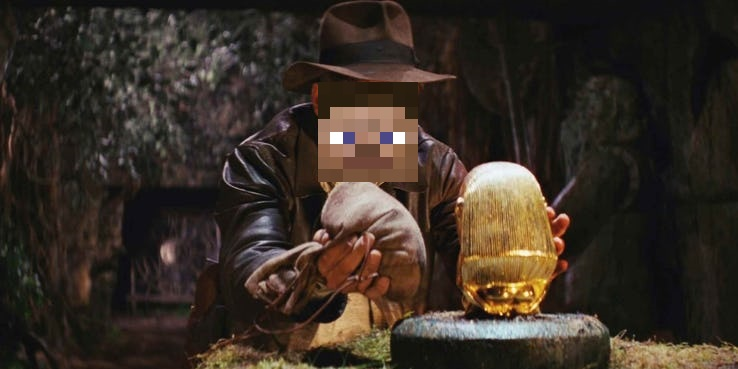

# Indiana Jones AI

Source code: https://github.com/denn9s/indiana-jones

Our project, based on the Indiana Jones movies, involves an AI that learns to dodge arrows fired from the walls in order to reach a treasure at the end of the path. The arrows will be randomly fired from the dispensers at the side of the pathways, and we aim to have an AI that can learn to stop and go through the flurry of arrows.

Reports:

- [Proposal](proposal.html)
- [Status](status.html)
- [Final](final.html)
