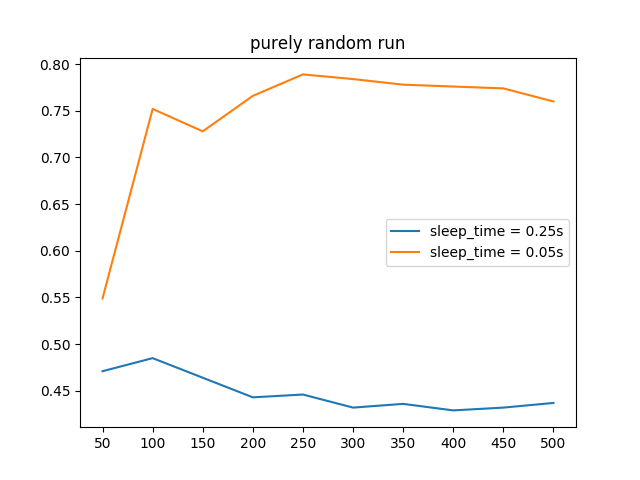

# {{ page.title }}

## Video Summary

## Summary
Our overall goal was to have our agent be able to dodge various enemy projectiles, such as skeleton arrows or blaze fireballs in order to reach a chest. However, we wanted to modify our environment to be slightly more controlled, so we decided to have our agent dodge arrows fired from dispensers. We wanted our progress to have a solid, simple foundation, so we designed our agent to dodge a single incoming arrow from a dispenser. As of now, our agent is designed to solely move forwards and backwards in order to dodge incoming arrows from the sides. We incorporated reinforcement learning by utilizing q-tables, Q-learning, to allow the agent to dodge the projectiles and reach the goal.

## Approach
Our main approach to reaching our goal is to have our agent bounded by the sides in order to lower the amount of states. The agent is also spawned in the same spawn point, with the goal being 9 blocks down the straight path. We also kept the dispenser at the same position, aimed at the middle of the agent's path. The dispenser will be positioned 6 units away from the pathway of the agent.

We decided that Q-learning was the best approach to developing our agent's movements. As a whole, it seemed that Q-learning would be the best approach due to the fact that we could break down our environment into easily-defined states and rewards. Restraining our agent to a straight pathway also helped in reducing the size of the Q-table.

## Evaluation

### Quantitative Evaluation
Our main criteria for the quantitative evalution of our agent is how far the agent moved from its spawn position before it was hit by an arrow. However, due to the nature of our current one arrow implementation, this evaluation in our current state was not that useful as the agent either is hit by the arrow, or passes the arrow tile and retrieves the treasure. We decided to look at additional factors, such as the time the agent "sleeps" after an action, whether the agent decided to wait, or if the agent was lucky and avoided an arrow. Our agent had gone through numerous iterations of different reward configurations in order to determine what was the sweet spot for the best performance. These factors will be explained shortly below, after showing the results of our early testing methods.

As an initial test, we created a "hard-coded run" that had the agent stop before the arrow and then move based on the arrow position. This allowed us to see the win-rate in a controlled setting to limit other potential factors that may have affected the run, mainly being random chance. This "hard coded" run allowed us to visualize an ideal q-table.

We ran the "hard coded" run for 100 episodes per arrow position. The win-rates for moving on each corresponding arrow position showed intuitive data. Wait if it's on the left, and move when it passes.

| | 455  |  454 |   453  |  452 |  451 |   450  |  449 |   448   | 447  |  446/None
|---|---|---|---|---|---|---|---|---|---|---|
 -314 | .57  |  .22   | .14  |  .19   | .42  |  .75  |  .90   | .88  |  .79 |   Inconsistent data

To build off of this, we created a "purely random run", where the agent randomly chooses to wait or walk. We wanted to see if the win-rates and q-tables of the random runs were similar to the win-rates and q-tables of our future regular runs, so we could judge if the optimal reward setting was applied or required adjusting. 

We ran the purely random run for 500 episodes. During this run, we found our first factor for the testing; how long an agent should "sleep" after an action. We were quick to choose a sleep time of 0.05 after an initial setting of 0.25 proved bad and possibly did not let the agent to poll the most its possible observations properly. A lower sleep time also allowed future testing to become much more faster.

The resultant stripped down q-table of the purely random run with a sleep time of 0.05 showed inconclusive q-values.
The q-values are shown in terms of move/wait ratios. A larger left number means it is more rewarding to move, etc.

| | 455 |	454 |	453 |	452 |	451 |	450 |	449 |	448 |	447 |	446/None |
|---|---|---|---|---|---|---|---|---|---|---|
-313 |	49/50 |	44/55 |	49/50 |	42/57 |	20/79 |	57/42 |	37/62 |	50/49 |	40/59 |	50/49 	
-314 |	50/49 |	49/50 |	51/48 |	51/48 |	52/47 |	54/45 |	52/47 |	50/49 |	49/50 |	47/52 

Afterwardsm we tested a "base run" with an epsilon of 0.2 (20% chance to perform a random action) for 500 episodes. The win-rate results were already promising, but lacked substantial growth.

The stripped down q-table of the base run showed much more wild values. Although some values were well in line with the results of the hard-coded run, a lot of other values did not match up, possibly due to a small of number of times the agent encounters these particular states.

| | 455 |	454 |	453 |	452 |	451 |	450 |	449 |	448 |	447 |	446/None |
|---|---|---|---|---|---|---|---|---|---|---|
-313 |	31/68 |	34/65 |	37/62 |	54/45 	|89/10 |	move |	54/45| 	53/46| 	47/52| 	56/43 	
-314 |	25/74 |	42/57 |	66/33 |	56/43 |	42/57 |	55/44 |	66/33 |	48/51 	|52/47 	|49/50 	

Our "regular runs" came after as we created more factors to the evaluation, which merely multiply and scale the main quantitative evaluation by a small amount up or down. These factors include the result of the mission (death or complete), and specific situations the agent is in (deciding to wait or avoiding an arrow upon moving). The first two factors served to amplify the impact of the mission result, and the latter two serve to help encourage habits, particularly to discourage unnecessary waiting and to encourage life-saving movement.

We tested 5 regular runs, each with different factor multiplier configurations. The win-rate results proved the factors to be helpful.

The stripped down q-table for a regular run with death/complete/wait/avoid configurations of -10/10/0.75/3.00 showed even more wild q-values. Although they're not perfect, they are mostly plausible.

| | 455 |	454 |	453 |	452 |	451 |	450 |	449 |	448 |	447 |	446/None |
|---|---|---|---|---|---|---|---|---|---|---|
-313	| 35/64 |	59/40 |	59/40 |	37/62 |	move |	move |	move |	40/59 |	24/75 |	wait 	
-314 |	85/14 |	36/63 |	6/93 |	57/42 |	89/10 |	34/65 |	54/45 |	56/43 |	42/57 |	62/37 	

### Qualitative Evaluation
The main method we can use to evaluate our agent's actions is by watching how it performs against the arrow over time. We should mainly be watching how the agent walks across the walkway, noting whether or not it is stopping/going randomly. Ideally, we would view a good result as non-random movement after a decent amount of episodes, while a bad result would be completely random movement (reaching the goal by pure luck).

## Remaining Goals and Challenges
Currently, our agent is constrained to a dodging a single arrow in an extremely short path. We would like for our agent to be able to dodge multiple arrows coming from dispensers at randomized positions. With that being said, we would like to have the agent's path to the goal be longer. We would like take our simplified version and up the scale of it by placing more dispensers around, and also placing the dispensers in random positions. Our agent also at the moment can only take one arrow to be considered a fail. One of our goals is to allow the agent to get hit instead of restarting the mission, and incorporating that information into our rewards system.    

Some challenges that we were facing are continuting to optimize our reward settings as the increase in winrate between our regular runs and random runs is moderate currently due to our one arrow setup, however once we incorporate mulitple dispensers, we would have to adjust the reward as it would be a more important factor in the success rate of our agent. An interesting challenge that may pop up is whether the agent can learn and consistently get to the goal in a reasonable amount of time, after a certain amount of dispensers are placed. The time it takes for consistent success would increase dramatically in relation to the amount of arrow dispensers placed. A possible solution to this problem is to either take away the random placements of the dispensers, provide the agent with previous run's information or decrease the amount of dispensers once the time it takes per iteration becomes unreasonable.

 

## Resources Used
